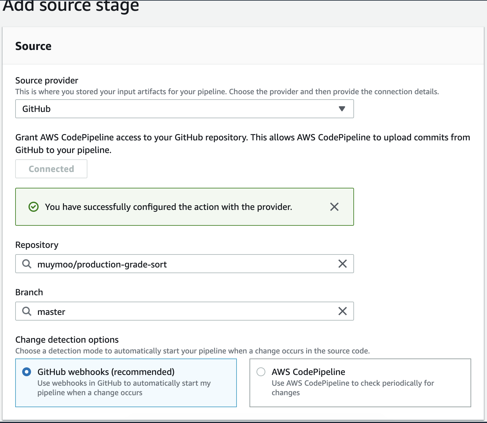
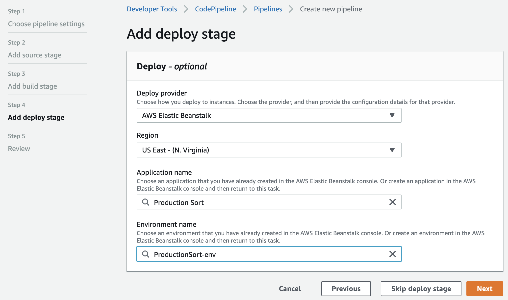
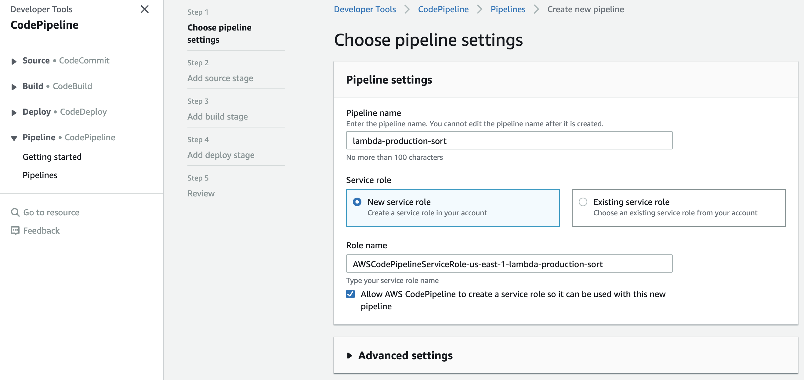

# Sorting API
## Deployed Two Ways: AWS Elastic Beanstalk and Lambda
This repo shows how to deploy the same sorting API in two different ways:
1. [AWS ElasticBeanstalk](https://aws.amazon.com/elasticbeanstalk/)
2. [AWS Lambda](https://aws.amazon.com/lambda/)

At the end you'll have two API's that sort a list of numbers:


## Prereqs
- [AWS account](https://aws.amazon.com/) with admin access
- [AWS CLI](https://aws.amazon.com/cli/) installed on laptop
- [GitHub](https://github.com/) account

## Day 1: Manual Deployment
```bash
git clone https://github.com/muymoo/production-grade-sort.git
cd production-grade-sort
```
(#elastic-beanstalk)
### Elastic Beanstalk
1. `cd elasticbeanstalk`
2. Create zip: `zip -X ../elasticbeanstalk application.py requirements.txt` 
2. Create [AWS Elastic Beanstalk Environment](https://console.aws.amazon.com/elasticbeanstalk/home)
   1. Environment Tier: Web Server Environment
   2. Platform: Python
   3. Upload your code - use zip from step #1

### AWS Lambda
1. Create Lambda
   1. From Scratch
   2. Python 3.6
2. Copy handler code in from `lambda/handler.py` - rename `sort()` to `lambda_handler()`
3. Test with event:
``` 
{
  "queryStringParameters": {
      "numbers": "3,2,1,4"
  }
}
```
4. Create new AWS API Gateway REST API
5. New Method: GET
6. Lambda Function, Use Lambda Proxy Integration
7. Method Request: URL Query String Parameters - `numbers`
8. "Test"

## Day 2: Automated Pipeline 
### Elastic Beanstalk
1. Follow steps from Day 1 - ["Elastic Beanstalk"](#elastic-beanstalk)
2. Fork this repository
3. [Code Pipeline](http://console.aws.amazon.com/codepipeline)
4. "Create New Pipeline"
5. Name: `eb-production-sort`, Role: Create New
6. Source Provider: GitHub
7. "Connect to GitHub"
8. 
9. CodeBuild: "Create Project"
   1. Name: `eb-production-sort-build`
   2. Env: `Managed Image` > `Amazon Linux 2`
   3. Runtimes: `Standard`, Use defaults in drop downs
   4. Use buildspec file. Location: `elasticbeanstalk/buildspec.yml`
   5. "Continue to CodePipeline"
10. Deploy to ElasticBeanstalk environment we careated in step #1

11. "Next", "Create Pipeline"
12. Test by committing a change to your repo. Your pipeline should start automatically.

Inspired by: https://aws.amazon.com/getting-started/tutorials/continuous-deployment-pipeline/ (uses PHP instead of Python)
### AWS Lambda
1. In [IAM](https://console.aws.amazon.com/iam/home), create role:
   1. Trusted entity – AWS CloudFormation
   2. Permissions – AWSLambdaExecute
   3. Role name – cfn-lambda-pipeline
   4. Inline Policy:
   ```
   {
    "Statement": [
        {
            "Action": [
                "apigateway:*",
                "codedeploy:*",
                "lambda:*",
                "cloudformation:CreateChangeSet",
                "iam:GetRole",
                "iam:CreateRole",
                "iam:DeleteRole",
                "iam:PutRolePolicy",
                "iam:AttachRolePolicy",
                "iam:DeleteRolePolicy",
                "iam:DetachRolePolicy",
                "iam:PassRole",
                "s3:GetObjectVersion",
                "s3:GetBucketVersioning"
            ],
            "Resource": "*",
            "Effect": "Allow"
        }
    ],
    "Version": "2012-10-17"
   }
   ```
2. [Code Pipeline](http://console.aws.amazon.com/codepipeline)
3. "Create New Pipeline"
4. 
5. Source Provdier: GitHub"
6. "Connect to GitHub"
7. Use your repository from Elastic Beanstalk: Step #2
8. CodeBuild "Create Project"
   1. Name: `lambda-production-sort-build`
   2. Env: `Managed Image` > `Amazon Linux 2`
   3. Runtimes: `Standard`, Use defaults in drop downs
   4. Use buildspec file. Location: `lambda/buildspec.yml`
   5. "Continue to CodePipeline"
9. Deploy Provider: CloudFormation
   1. Action Mode: `Create or replace a change set`
   2. Stack Name: `lambda-pipeline-stack`
   3. Changeset Name: `lambda-pipeline-changeset`
   4. Template – BuildArtifact::outputtemplate.yml
   5. Capabilities – CAPABILITY_IAM
   6. Role name – cfn-lambda-pipeline
10. "Create Pipeline"
11. Update build role to allow S3 access
   1. [Roles](https://console.aws.amazon.com/iam/home#/roles)
   2. Update role `codebuild-lambda-production-sort-build-service-role` to have `AmazonS3FullAccess` policy.
12. Edit deploy stage. Add action:
   1. Action name: `execute-changeset`
   2. Action provider: `AWS CloudFormation`
   3. Input artifacts: `BuildArtifact`
   4. Action mode: `Execute a change set`
   5. Stack name: `lambda-pipeline-stack`
   6. Change set name: `lambda-pipeline-changeset`

https://docs.aws.amazon.com/lambda/latest/dg/build-pipeline.html
